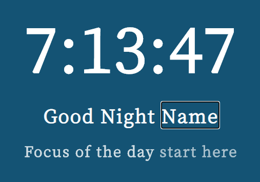
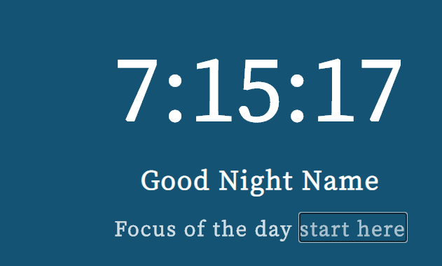
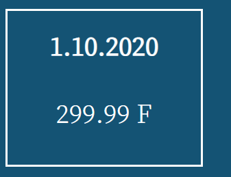
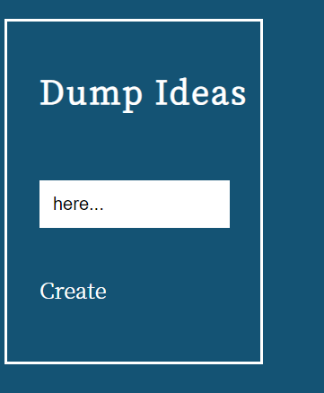

# Landing-Page
The is inspried by google chrome extension "Moment".

The landing page is encapsulates three main sections.

---

1. Main Content section, the clock and greetings of the day section.
  -  The Clock is showing current time in 12 hour format.
  -  The Greetings of the day changes according to the current time along with background color of the body.
  -  The Greetings section is also editable where individual can key-in their own name on the page , to give a customized effect.
  
      
      
  -  The Focus of the day section is also editable so that new entries can be made every new day.
  
      
        
---
  
2. Weather Content section , The Date and Temperature section.
  - The Date and temperature is updated when the page loads on the top right corner of the page.
  
      
      
  - Weather is recorded as per open weather api and user's geolocation coordinates.  
  
---
  
3. To-do Section.
    - The user can dump ideas/action items in the area to get started with the day.
    
        
    
  
